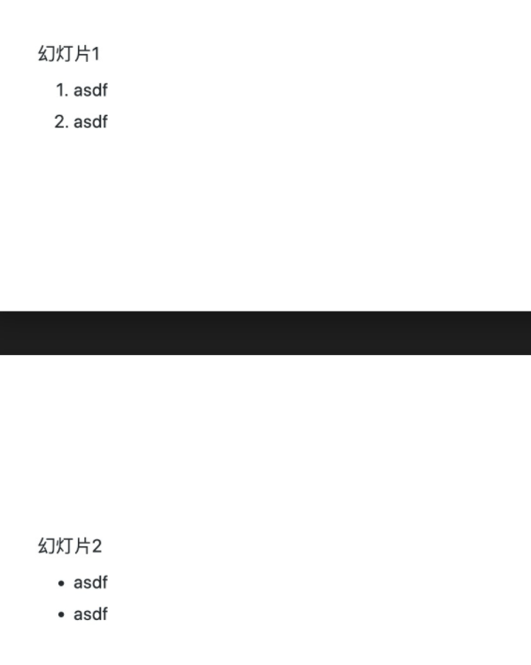

<style>
section {
  background: #FDF6DF;
  color:#555;
  padding:50px;
  font-size: 40px;
}
footer {
  bottom: 30px;
}
h1 {
  font-size: 60px;
  color: #09c;
}
h2 {
  font-size: 50px;
}
h5 {
  font-size: 20px;
}
section::after {
  content: 'Page ' attr(data-marpit-pagination) ' / ' attr(data-marpit-pagination-total);
}
</style>

<!-- headingDivider: 2 -->  

# 字体
`> 这里是引用` > 这里是引用 

`**粗体**` **粗体**  
`*斜体*`   *斜体*
`~~删除线~~` ~~删除线~~

# 表格
```
| 实验组 | 时间 | 数量 |
| :---- | :--: | ---: |
| M1 | 1h | 120000 |
```
| 实验组 | 时间 | 数量 |
| :---- | :--: | -----: |
| M1 | 1h | 120000 |
| M2 | 2h | 140000 |

# 代码块
* 方式一:用``` 把代码包起来
```
Python
print("hi")
```
* 方式二:行内代码,用``把代码包起来
`print("hi")`正文

# 背景图
```


```

# vs code markdown 编写PPT
1. 安装Marp for VS Code插件
2. 安装Markdown All in One插件
3. 让编辑器:加上头部
4. 完成后,通过编辑器右上角的 Marp 图标按钮就可以调出 Export slide deck... 命令并导出幻灯片
5. 参考自:https://zhuanlan.zhihu.com/p/149521766

# 最简单示例

```
    ---
    marp: true
    ---
    幻灯片1

    1. asdf
    2. asdf
    ---
    幻灯片2

    * asdf
    * asdf
```

# 优化样式
有三款主题可以选择，可以参考[themes][]，有的主题只能居中，我选了一个可居中也可居左的主题
```
    ---
    marp: true
    theme: gaia
    footer: '机智的小熊 2020-06-18'
    paginate: true
    style: |
    section a {
        font-size: 30px;
    }
    ---
```
# 
* footer 代表是页尾， header 代表页首
* paginate 是否在右下角标页码
* style 自定义[全局样式][]，插件所有的样式参考官网提供的样式

# 常用语法汇总
* color: red 设置字体颜色
* paginate: true 显示页码, _paginate: false 屏蔽当前页面页码
* 有三款主题可以选择，可以参考[themes][]
* [官网提供的样式][]
* [官网提供的语法汇总][]
* [更多 p 图命令][]
* [官网文档调整大小、滤镜，图片作背景的布局、尺寸、分割][]
* [更多背景图片文字排版命令][]
  

# 定制的主题
```
---
marp: true
theme: gaia 
footer: 'canbus 2021-12-28'
paginate: true
---
<style>
section {
  background: #FDF6DF;
  color:#555;
  padding:50px;
  font-size: 40px;
}
footer {
  bottom: 30px;
}
h1 {
  font-size: 60px;
  color: #09c;
}
h2 {
  font-size: 50px;
}
h5 {
  font-size: 20px;
}
section::after {
  content: 'Page ' attr(data-marpit-pagination) ' / ' attr(data-marpit-pagination-total);
}
</style>

<!-- headingDivider: 2 -->  
```

[themes]:https://github.com/marp-team/marp-core/tree/master/themes
[全局样式]:https://www.zhihu.com/search?q=%E5%85%A8%E5%B1%80%E6%A0%B7%E5%BC%8F&search_source=Entity&hybrid_search_source=Entity&hybrid_search_extra=%7B%22sourceType%22%3A%22article%22%2C%22sourceId%22%3A149521766%7D
[官网提供的样式]:https://marpit.marp.app/theme-css
[官网提供的语法汇总]:https://marpit.marp.app/directives
[更多 p 图命令]:https://marpit.marp.app/image-syntax?id=image-filters
[官网文档调整大小、滤镜，图片作背景的布局、尺寸、分割]:https://marpit.marp.app/image-syntax
[更多背景图片文字排版命令]:https://marpit.marp.app/image-syntax?id=advanced-backgrounds
[Marpit Markdown使用教程]:https://www.jianshu.com/p/7702cddafca0
